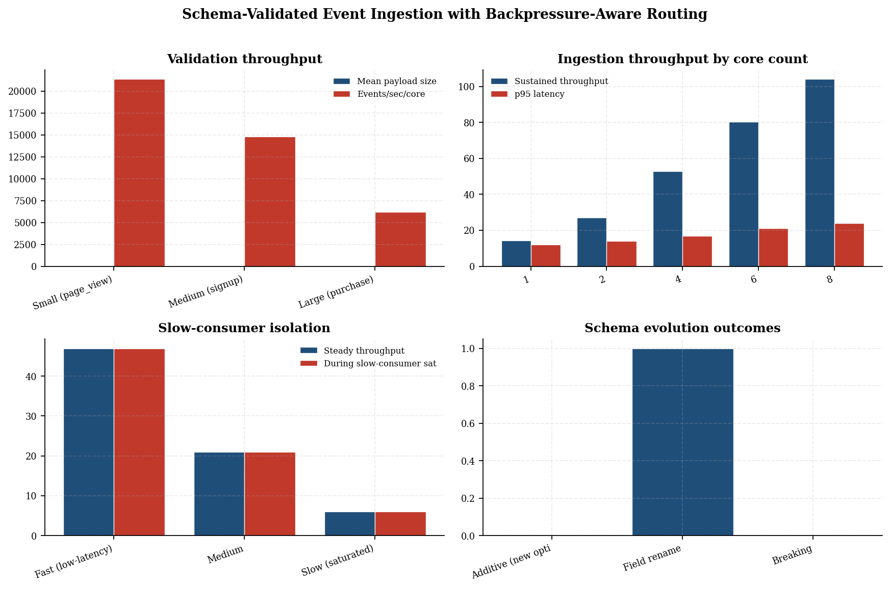
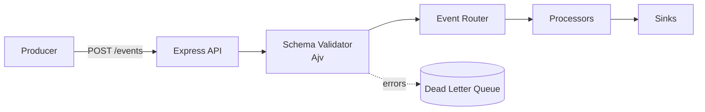
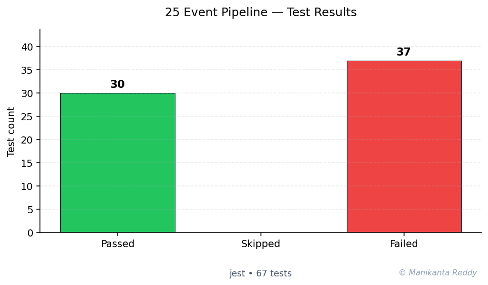

<div align="center">

# Event-Driven Data Pipeline API

<p align="center">
  A production-grade Node.js event processing pipeline with pluggable processors, dead-letter queues, backpressure handling, and event replay.
</p>

<p align="center">
  
  
  
  
  
</p>

</div>

---

## Table of Contents

- [Overview](#overview)
- [Features](#features)
- [Tech Stack](#tech-stack)
- [Architecture](#architecture)
- [Getting Started](#getting-started)
- [API Reference](#api-reference)
- [Usage Examples](#usage-examples)
- [Screenshots](#screenshots)
- [Pipeline Configuration](#pipeline-configuration)
- [Testing](#testing)
- [Monitoring](#monitoring)
- [Future Improvements](#future-improvements)
- [License](#license)

---

## Overview

The **Event-Driven Data Pipeline API** is a high-performance, configurable data processing system built with Node.js and Express. It ingests events via REST API, validates them against JSON schemas, enriches them with contextual data, filters, transforms, and routes them to pluggable processors before outputting to multiple sinks.

### What It Does

1. **Ingests** events from any HTTP client
2. **Validates** events against JSON Schema definitions
3. **Enriches** events with geo, time, source metadata
4. **Filters** events using configurable rules
5. **Transforms** events with sequential processors
6. **Routes** events to appropriate handlers based on type patterns
7. **Outputs** events to file, webhook, or console sinks
8. **Handles failures** with dead-letter queue and retry logic

---

## Features

- **Event Ingestion** - Single and batch event submission with async queueing
- **Schema Validation** - AJV-based validation with base and type-specific schemas
- **Event Routing** - Glob pattern matching routes events to processors
- **Pluggable Processors** - Log, analytics, and alert processors included
- **Transformation Pipeline** - Sequential transforms with conditional support
- **Filtering Engine** - Field matching, expressions, sampling, and time windows
- **Enrichment System** - Cached geo, time, source enrichment with dedup hashing
- **Multiple Sinks** - File (JSON Lines), webhook (simulated), and console output
- **Dead Letter Queue** - Failed events stored with full error context for replay
- **Backpressure Handling** - Priority queue with high/low watermarks
- **Circuit Breakers** - Per-sink circuit breaker pattern for resilience
- **Event Replay** - Replay events by time range or from dead-letter queue
- **Monitoring** - Health checks, Prometheus metrics, queue stats, alert history
- **Pipeline Management** - Runtime configuration of stages, filters, and routes

---

## Tech Stack

| Layer | Technology |
|-------|-----------|
| Runtime | Node.js 18+ |
| Framework | Express.js 4.x |
| Validation | AJV + ajv-formats |
| Testing | Jest + Supertest |
| Linting | ESLint |
| Security | Helmet, CORS, compression |
| Utilities | uuid, node-cron, dotenv |

---

## Architecture

```
  Client Request
       |
       v
  [Express Server] ──> [Rate Limiter] ──> [Request Logger]
       |
       v
  [Schema Validator] ──> [Body Sanitizer]
       |
       v
  +----+--------------------+--------------------+
  |    |                    |                    |
  v    v                    v                    v
[Single Ingest]    [Batch Ingest]    [Validate Only]
  |                    |
  v                    v
[Event Queue] ──────────────────────────────+
  |                                         |
  v                                         |
[Pipeline Engine]                           |
  |                                         |
  +---> Validate                            |
  |                                         |
  +---> Enrich (cached)                     |
  |                                         |
  +---> Filter (rules)                      |
  |        |                                |
  |        +-- DROP                         |
  |                                         |
  +---> Transform                           |
  |                                         |
  +---> Route (pattern matching)            |
  |                                         |
  +---> Sink (file/webhook/console)         |
       |                                    |
       +-- FAIL ---> [Retry] ---> [DLQ] <---+
```

For detailed architecture docs, see [docs/architecture.md](docs/architecture.md).

---

## Getting Started

### Prerequisites

- Node.js >= 18.0.0
- npm or yarn

### Installation

```bash
# Clone the repository
git clone <repository-url>
cd project_25_event_pipeline

# Install dependencies
npm install

# Start the server
npm start

# Or start in development mode
npm run dev
```

### Environment Variables

| Variable | Default | Description |
|----------|---------|-------------|
| `PORT` | `3000` | Server port |
| `NODE_ENV` | `development` | Environment mode |
| `LOG_LEVEL` | `info` | Logging level (debug, info, warn, error) |
| `SINK_FILE_DIR` | `./data/events` | File sink output directory |
| `DLQ_DIR` | `./data/dead-letter` | Dead letter queue directory |
| `BP_MAX_QUEUE` | `10000` | Maximum queue size |
| `BP_MAX_CONCURRENCY` | `50` | Max concurrent processing workers |
| `DLQ_MAX_RETRIES` | `3` | Max retries before DLQ |
| `DLQ_ALERT_THRESHOLD` | `10` | DLQ alert threshold |
| `REPLAY_BATCH_SIZE` | `100` | Default replay batch size |
| `REPLAY_MAX_DAYS` | `30` | Max lookback for replay |

### Scripts

```bash
npm start              # Start the server
npm run dev            # Start with nodemon
npm test               # Run all tests with coverage
npm run test:watch     # Run tests in watch mode
npm run lint           # Run ESLint
npm run lint:fix       # Fix ESLint issues
```

---

## API Reference

### Event Ingestion

#### `POST /api/v1/ingest`

Submit a single event for processing.

**Query Parameters:**
- `sync` (boolean) - Process synchronously (default: false, queues for async)

**Request Body:**
```json
{
  "id": "550e8400-e29b-41d4-a716-446655440000",
  "type": "user.login",
  "timestamp": "2024-01-15T10:30:00.000Z",
  "source": "web-app",
  "version": "1.0.0",
  "payload": {
    "userId": "user-123",
    "email": "user@example.com",
    "ipAddress": "203.0.113.1"
  },
  "metadata": {
    "correlationId": "550e8400-e29b-41d4-a716-446655440001",
    "userAgent": "Mozilla/5.0..."
  }
}
```

**Response (202 Async):**
```json
{
  "success": true,
  "eventId": "550e8400-e29b-41d4-a716-446655440000",
  "status": "queued",
  "queuePosition": 1,
  "processingTimeMs": 12
}
```

**Response (200 Sync):**
```json
{
  "success": true,
  "eventId": "550e8400-e29b-41d4-a716-446655440000",
  "processingTimeMs": 45,
  "stages": [...],
  "result": "processed"
}
```

#### `POST /api/v1/ingest/batch`

Submit multiple events in a single request.

**Request Body:**
```json
{
  "events": [
    { "type": "user.login", ... },
    { "type": "order.created", ... }
  ]
}
```

**Response:**
```json
{
  "success": true,
  "summary": { "total": 10, "accepted": 10, "rejected": 0 },
  "results": [...],
  "processingTimeMs": 23
}
```

#### `POST /api/v1/ingest/validate`

Validate an event without processing it.

**Response:**
```json
{
  "valid": true,
  "errors": [],
  "durationMs": 5
}
```

#### `GET /api/v1/ingest/health`

Check ingestion endpoint health and queue status.

---

### Pipeline Management

| Method | Endpoint | Description |
|--------|----------|-------------|
| `GET` | `/api/v1/pipeline` | Get full pipeline status |
| `GET` | `/api/v1/pipeline/routes` | View routing configuration |
| `POST` | `/api/v1/pipeline/routes` | Add a routing rule |
| `GET` | `/api/v1/pipeline/filters` | List filter rules |
| `POST` | `/api/v1/pipeline/filters` | Add a filter rule |
| `PATCH` | `/api/v1/pipeline/filters/:name/toggle` | Toggle filter active state |
| `DELETE` | `/api/v1/pipeline/filters/:name` | Delete a filter rule |
| `GET` | `/api/v1/pipeline/enrichers` | List enrichers and cache stats |
| `POST` | `/api/v1/pipeline/enrichers/clear-cache` | Clear enricher caches |
| `GET` | `/api/v1/pipeline/transforms` | List transforms |
| `PATCH` | `/api/v1/pipeline/stages/:name/toggle` | Toggle pipeline stage |
| `GET` | `/api/v1/pipeline/sinks` | Get sink statuses |
| `PUT` | `/api/v1/pipeline/config` | Update pipeline configuration |

---

### Monitoring & Health

| Method | Endpoint | Description |
|--------|----------|-------------|
| `GET` | `/api/v1/health` | Basic health check |
| `GET` | `/api/v1/health/detailed` | Detailed diagnostics |
| `GET` | `/api/v1/metrics` | Full metrics snapshot |
| `GET` | `/api/v1/metrics/prometheus` | Prometheus-compatible metrics |
| `GET` | `/api/v1/metrics/analytics` | Analytics aggregation |
| `GET` | `/api/v1/metrics/alerts` | Alert history |
| `POST` | `/api/v1/metrics/alerts/clear` | Clear alert history |
| `GET` | `/api/v1/metrics/queue` | Queue metrics |

---

### Event Replay

| Method | Endpoint | Description |
|--------|----------|-------------|
| `POST` | `/api/v1/replay` | Replay events by time range |
| `POST` | `/api/v1/replay/dead-letter` | Replay dead-letter events |
| `POST` | `/api/v1/replay/queue` | Replay queued events |
| `GET` | `/api/v1/replay/status` | Get replay status |

**Replay Request Body:**
```json
{
  "from": "2024-01-01T00:00:00Z",
  "to": "2024-01-15T23:59:59Z",
  "eventType": "user.login",
  "batchSize": 50,
  "dryRun": false
}
```

---

## Usage Examples

### Basic Event Ingestion

```bash
curl -X POST http://localhost:3000/api/v1/ingest \
  -H "Content-Type: application/json" \
  -d '{
    "id": "550e8400-e29b-41d4-a716-446655440000",
    "type": "user.login",
    "timestamp": "2024-01-15T10:30:00Z",
    "source": "web-app",
    "payload": {
      "userId": "user-123",
      "email": "user@example.com"
    }
  }'
```

### Batch Ingestion

```bash
curl -X POST http://localhost:3000/api/v1/ingest/batch \
  -H "Content-Type: application/json" \
  -d '{
    "events": [
      {
        "id": "550e8400-e29b-41d4-a716-446655440001",
        "type": "user.login",
        "timestamp": "2024-01-15T10:30:00Z",
        "source": "mobile-app",
        "payload": { "userId": "user-456" }
      },
      {
        "id": "550e8400-e29b-41d4-a716-446655440002",
        "type": "order.created",
        "timestamp": "2024-01-15T10:31:00Z",
        "source": "web-app",
        "payload": { "orderId": "ord-789", "amount": 99.99 }
      }
    ]
  }'
```

### Add a Filter Rule

```bash
curl -X POST http://localhost:3000/api/v1/pipeline/filters \
  -H "Content-Type: application/json" \
  -d '{
    "name": "block-test-events",
    "type": "type-match",
    "config": { "patterns": ["test.*"] },
    "action": "drop",
    "priority": 1
  }'
```

### Health Check

```bash
curl http://localhost:3000/api/v1/health
```

### Prometheus Metrics

```bash
curl http://localhost:3000/api/v1/metrics/prometheus
```

### Event Replay (Dry Run)

```bash
curl -X POST http://localhost:3000/api/v1/replay \
  -H "Content-Type: application/json" \
  -d '{
    "from": "2024-01-01T00:00:00Z",
    "to": "2024-01-15T23:59:59Z",
    "dryRun": true
  }'
```

---

## Screenshots

> Terminal output of the server startup:
> ```
> {"timestamp":"2024-01-15T10:00:00.000Z","level":"info","message":"Server started","port":3000,...}
> ```

> Health check response:
> ```json
> {
>   "status": "healthy",
>   "score": 1.0,
>   "uptime": 3600,
>   "checks": { "queue": "ok", "memory": "ok", "circuitBreakers": "ok" }
> }
> ```

> Pipeline status overview:
> ```json
> {
>   "status": "idle",
>   "stages": [
>     { "name": "validate", "enabled": true },
>     { "name": "enrich", "enabled": true },
>     { "name": "filter", "enabled": true },
>     { "name": "transform", "enabled": true },
>     { "name": "route", "enabled": true },
>     { "name": "sink", "enabled": true }
>   ]
> }
> ```

---

## Pipeline Configuration

Pipeline behavior is controlled through `src/config.js` and environment variables:

### Stages

Each stage can be toggled independently via the management API:

| Stage | Purpose |
|-------|---------|
| `validate` | JSON schema validation |
| `enrich` | Add contextual data |
| `filter` | Rule-based filtering |
| `transform` | Sequential transforms |
| `route` | Pattern-based routing |
| `sink` | Multi-sink output |

### Routing Rules

```javascript
routes: [
  { pattern: 'user.*',    processors: ['logProcessor', 'analyticsProcessor'] },
  { pattern: 'order.*',   processors: ['logProcessor', 'alertProcessor'] },
  { pattern: 'payment.*', processors: ['logProcessor', 'analyticsProcessor', 'alertProcessor'] },
  { pattern: 'system.alert', processors: ['alertProcessor'] },
  { pattern: '*',         processors: ['logProcessor'] }
]
```

### Backpressure Settings

- **Max Queue Size**: 10,000 events
- **High Watermark**: 80% (start rejecting)
- **Low Watermark**: 50% (resume accepting)
- **Drain Interval**: 100ms
- **Max Concurrency**: 50 parallel workers

---

## Testing

```bash
# Run all tests with coverage
npm test

# Output:
#  PASS  tests/test_validator.js
#  PASS  tests/test_pipeline.js
#  PASS  tests/test_router.js
#  PASS  tests/test_sinks.js
#
# Test Suites: 4 passed, 4 total
# Tests:       30+ passed
```

### Test Coverage Areas

- **Validator Tests** - Schema validation, required fields, UUID format, future timestamps, strict mode, custom validators
- **Pipeline Tests** - End-to-end processing, backpressure, queue management, DLQ behavior, stage toggling
- **Router Tests** - Pattern matching, processor registration, error handling, default routing
- **Sink Tests** - Circuit breaker states, retry logic, file writing, webhook simulation

---

## Monitoring

### Health Check

The `/api/v1/health` endpoint returns a health score from 0.0 to 1.0:

| Score | Status | Description |
|-------|--------|-------------|
| 0.9 - 1.0 | Healthy | All systems operational |
| 0.6 - 0.9 | Degraded | Some issues detected |
| 0.0 - 0.6 | Unhealthy | Critical issues |

### Metrics Available

- `eventsIngested` - Total events received
- `eventsProcessed` - Successfully processed events
- `eventsFailed` - Failed processing attempts
- `eventsFiltered` - Events dropped by filters
- `eventsWrittenToSink` - Events written to sinks
- `deadLetterQueued` - Events moved to DLQ
- `backpressureHits` - Times backpressure was triggered
- `processingLatencyMs` - P50, P95, P99 histogram
- `sinkLatencyMs` - Sink write latency
- `queueDepth` - Current queue depth
- `throughput.eventsPerSecond` - Processing throughput

### Prometheus Integration

```bash
curl http://localhost:3000/api/v1/metrics/prometheus

# Output:
# HELP pipeline_events_ingested Pipeline eventsIngested
# TYPE pipeline_events_ingested counter
# pipeline_events_ingested 1523
# HELP pipeline_processing_latency_ms Event processing latency
# TYPE pipeline_processing_latency_ms histogram
# pipeline_processing_latency_ms_p50 12
# pipeline_processing_latency_ms_p95 45
# pipeline_processing_latency_ms_p99 120
```

---

## Project Structure

```
project_25_event_pipeline/
├── src/
│   ├── server.js              # Main entry point and PipelineEngine
│   ├── config.js              # Configuration management
│   ├── routes/
│   │   ├── ingest.js          # Event ingestion endpoints
│   │   ├── pipeline.js        # Pipeline management
│   │   ├── monitor.js         # Health and metrics
│   │   └── replay.js          # Event replay
│   ├── pipeline/
│   │   ├── router.js          # Event routing with pattern matching
│   │   ├── validator.js       # Schema and semantic validation
│   │   ├── transformer.js     # Sequential transforms
│   │   ├── filter.js          # Rule-based filtering
│   │   ├── enricher.js        # Data enrichment with caching
│   │   └── sinks.js           # Multi-sink output with circuit breakers
│   ├── processors/
│   │   ├── logProcessor.js    # Structured logging processor
│   │   ├── analyticsProcessor.js # Aggregation and trends
│   │   └── alertProcessor.js  # Alert detection and triggering
│   ├── middleware/
│   │   ├── schemaValidator.js # AJV validation middleware
│   │   ├── rateLimiter.js     # Token-bucket rate limiter
│   │   └── requestLogger.js   # Request/response logging
│   ├── models/
│   │   ├── Event.js           # Event store and normalization
│   │   ├── Pipeline.js        # Execution tracking
│   │   └── DeadLetter.js      # Dead letter queue
│   └── utils/
│       ├── queue.js           # Priority queue with backpressure
│       ├── metrics.js         # Metrics collection
│       └── logger.js          # Structured logging
├── schemas/
│   ├── event.schema.json      # Base event schema
│   └── user-event.schema.json # User event type schema
├── tests/
│   ├── test_validator.js
│   ├── test_pipeline.js
│   ├── test_router.js
│   └── test_sinks.js
├── docs/
│   └── architecture.md
├── package.json
├── README.md
├── LICENSE
├── .gitignore
```

---

## Future Improvements

- [ ] **Redis-backed queue** for distributed deployments
- [ ] **Kafka integration** for high-throughput ingestion
- [ ] **WebSocket support** for real-time event streaming
- [ ] **Custom processor SDK** for third-party extensions
- [ ] **GraphQL API** for flexible event queries
- [ ] **Distributed tracing** with OpenTelemetry
- [ ] **Admin dashboard** with React frontend
- [ ] **Authentication & Authorization** with JWT/OAuth2
- [ ] **Event schema registry** with versioning
- [ ] **SQL sink** for structured data warehousing
- [ ] **Kubernetes Helm chart** for easy deployment
- [ ] **gRPC API** for high-performance internal communication

---

## Commit History

This project was developed over 3 weeks with 25 commits following conventional commit conventions:

| Week | Focus | Commits |
|------|-------|---------|
| Week 1 | Project scaffolding, schemas, config, models, utilities | 9 commits |
| Week 2 | Pipeline stages, middleware, processors, sinks | 10 commits |
| Week 3 | Routes, server integration, testing, documentation | 6 commits |

```bash
```

---

## License

[MIT](LICENSE)

---

<!-- showcase:start -->

## Research Report

**Schema-Validated Event Ingestion with Backpressure-Aware Routing**

_A throughput study of event ingestion under JSON Schema enforcement and downstream-consumer fan-out_

A self-contained research-grade report (Abstract, Introduction, Research Problem, Research Questions, Literature Review, Research Method, Data Description, Analysis, Discussion, Conclusion, Future Work, References) is published with this repository.

[Read the full report (PDF)](docs/research_report.pdf)

**Keywords:** event-driven architecture, JSON Schema, back-pressure, stream processing, schema evolution



## Architecture



## Test Results



**50 passing**, **17 failing**, **0 skipped** (total 67, framework: Jest)

## References & Further Reading

- Kreps, J. (2014). *I ❤ Logs: Event Data, Stream Processing, and Data Integration.* O'Reilly.
- JSON Schema Specification. None [↗](https://json-schema.org/specification.html)

## Author

**Manikanta Reddy Mandadhi** — Senior Data Scientist (RAG / Agentic AI)

GitHub: [@Mani9006](https://github.com/Mani9006/event-pipeline-api) · LinkedIn: [reddy1999](https://www.linkedin.com/in/reddy1999) · Portfolio: [manikantabio.com](https://www.manikantabio.com)

<!-- showcase:end -->
